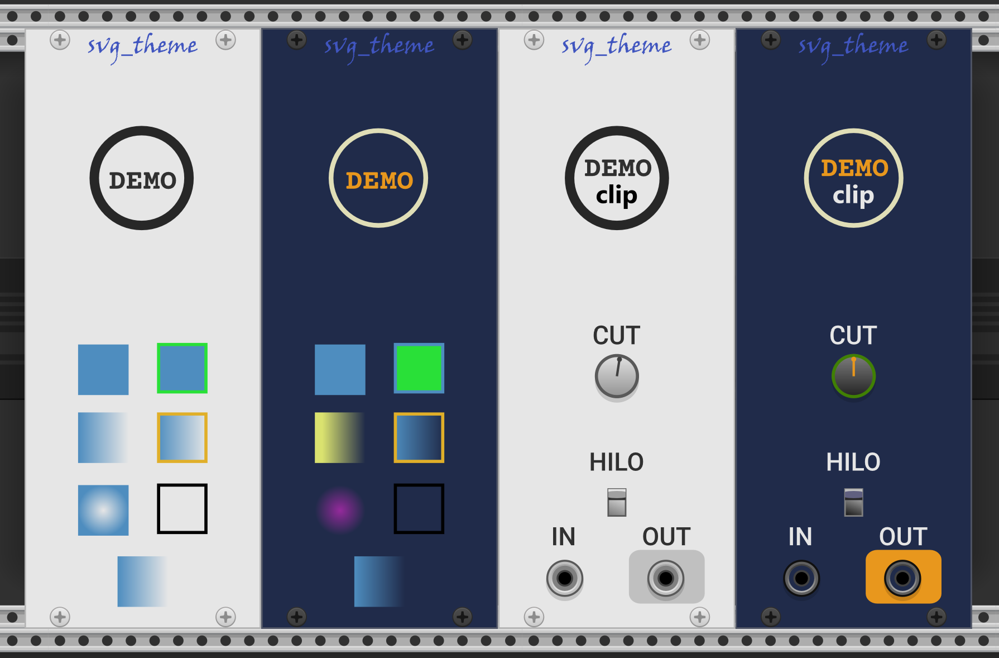

# svg_theme

**svg_theme** is a lean implementation of in-memory SVG theming for VCV Rack plugins.
This allows you to maintain a single SVG file for your module or widget,
regadless of how many skins or themes you want to provide for your modules.

Additional themes can be added just by editing a JSON configuration file, without rebuilding the plugin code.

This repository contains the implementation of svg_theme and a working demonstration plugin containing two modules: **Demo** and **Clip** with Light and Dark themes, selectable from the module right-click menu.



The **Demo** module focuses on theming SVG features in a "Blank" plate module. The **Clip** module is a working Rack module with parameters and widgets.

## Using svg_theme

This is a single-header-file implementation.
One and only one source file of your plugin must contain:

```cpp
#define IMPLEMENT_SVG_THEME
#include "svgtheme.hpp"    // SVG theming for nanosvg
#include "svt_rack.hpp" // VCV Rack-specific helpers
```

In the sample plugin, this is done in [`src/svg_theme_impl.cpp`](../src/svg_theme_impl.cpp).
In your project the path will be adjusted for whereever the header file exists for you.

Define your themes in a json file included with your plugin's resources.
You can have as many themes as you like, as long as they have unique names.
A theme is a collection of styles, similar to a very simplified CSS.
Styles can address a limited number of SVG attributes to reflect the theme.

The styles can be applied to any `NSVGimage*`, including the ones behind Rack's `Svg` class, and used by it's SVG-based UI widgets.

## SVG element ids and style tags

The SVG element id is used to target an element for modification.
Inkscape usually preserves ids across edits of the SVG, so the mechanism is realtively robust to editing.

To apply the same style to multiple elements, we use a style tag,
which consists of two dashes followed by the style name.
The dashes are not part of the style name.
Only a single tag (style) can be defined for a given element.

For example, the following elements from `Demo.svg` are tagged with `logo-text`
so that the same style is applied to both paths.

```xml
  <path id="o--logo-text" d="m 58.65,91.31 q 1.54,0 2.65,0.61  ..." />
  <path id="m--logo-text" d="m 73.32,91.31 q 0.31,0 0.44,0.13 ..." />
```

You can edit an object's id in Inkscape:
Right click and choose **Object Properties...**.
The id is separate from Inkscape's object label which is kept in a separate `inkscape:label` attribute.
Inkscape uses it's labels for what it shows you in **Layers and Objects**.
To help navigate an SVG when working on it to make a stylesheet,
I edit the SVG in a plain-text editor to make the Inkscape label the same as the id.

NanoSvg restricts ids to a maximum of 63 characters.

Unfortunately the current Rack SVGs in the component library do not contain ids, so they cannot be themed.
If you want to target Rack's SVG widgets, you must subclass the Rack widget and supply your own SVG(s) with ids added.

## svg_theme JSON format

The JSON is an array of theme objects.
A theme object has a `"name"` (the name of the theme) and a `"theme"` object.
The `"theme"` object members each provide a named style object with the definition of the attributes will be modified when the theme is applied.

A color is specified as a json string starting with a pound sign (often called 'hash') `#` followed by the hexadecimal code.
Syntax is #RGB, #RGBA (single hex digit for each component), or #RRGGBB, #RRGGBBAA (two hex digits for each component).
This hex notation is shown by the color pickers in most graphical editing applications, online color pickers, etc.

When creating your default theme, you can copy the colors directly from the SVG using a text editor or Inkscape.

A limited set of attributes can be modified by theming:

- Opacity of the element. A floating-point value from 0 to 1.0.

- Stroke and fill color. Unlike SVG, colors can include opacity.
To create transparent colors, append an alpha component to the RGB.
For example, this color is a 50% transparent medium blue: `#4086bf80`, where the `80` is the alpha value.

  Targeting only the opacity of a stroke or fill color is not supported -- only the full color as one unit.

- Stroke width. A floating point value for the width of a stroke.

- Color and offset of an existing gradient stop.

To target a gradient, the element in the master SVG must also define a gradient with a stop at that index (0 or 1).
This is necessary because the scheme does not have a complete definition of a gradient,
and we don't have the ability to create and destroy gradients in the SVG.

- Gradients can't be removed.
A color fill or stroke can be changed to 'none', but setting a gradient to a color or 'none' would cause a memory leak.

- Stroke dashes are not supported by nanoSvg, but there is no barriers to implementing such supprt.

## Example theme

```json
[
    {
        "name": "Light",
        "theme": {
            "theme_background": {
                "fill": {
                    "gradient": [            
                        {
                            "index":0,
                            "color":"#ee2e63",
                            "offset":0.0
                        }
                    ]
                },
                "stroke": { "color":"#808080", "width":1.5 }
            },
            "theme_no-fill": {
                "fill":"none",
            },
            "theme_no-stroke": {
                "stroke":"none",
            },
            "theme_bezel": {
                "fill": "#808080",
                "stroke": "#323232",
            },
            "theme_ouzel": {
                "opacity": 0.8,
                "fill": {
                    "gradient" [
                        {
                            "index":0,
                            "color":"#ec8d49",
                            "offset":0.0
                        },
                        {
                            "index":1,
                            "color":"#ec8d4900",
                            "offset":0.0
                        }
                    ]
                }
            }
        }
    },
    {
        "name": "Dark",
        "theme": {
        //...
        }
    }
]
```

Each style can have **opacity**, **fill**, and **stroke**.

### opacity

Sets the opacity of the entire element. This is a floating-point value between 0 and 1.0.

### fill

The **fill** is a hex color string value, **none**, or an object containing a **gradient**:

```json
    "strokeless-purple": {
        "fill" : "#952a9ccc",
        "stroke": "none"
    }
```

Color or **none** cannot be applied to an object with a gradient,
and a gradient cannot be applied to an element that does not have one.

Here is an example of a full gradient between two opaque colors:

```json
    "budgie": {
        "fill": {
            "gradient" [
                {
                    "index":0,
                    "color":"#3f7837",
                    "offset":0.0
                },
                {
                    "index":1,
                    "color":"#a01466",
                    "offset":0.0
                }
            ]
        }
    }
```

In a gradient, **index** is required to know whether to change gradient stop 0 or stop 1.
**color** and **offset** are optional, and need to be present only if you're changing it.

### stroke

A **stroke** is a hex color string value, **none**, or an object containing optional **color** string, **width** number, and **gradient** object.

The **gradient** object for stroke is identical to a gradient for a fill.
Note that at this writing, nanosvg doesn't appear to implement stroke gradients or stroke or fill radial gradients reliably,
so while these are supported by this library, you may not get the visual results you're after.

## Creating a theme

- Start with a design that will be one of your themes.
This will be your default theme and if you follow the Rack model, it would be your 'Light' theme.

  For the rest of this discussion we'll refer to this as the Light theme.

- Decide which elements will change depending on the theme.

- For each theme-able element, define a style in your Light theme in the JSON to address the things that will be changed.
This is necessary so that user can get back to the Light theme after changing it to something else.

- Copy the Light theme, rename it, and change the colors to suit.

- To prevent leftovers from one theme appearing when another is chosen,
each theme must provide the same set of styles, setting the same attributes (but with potentially different values).
At this time, the theme engine does not verify that themese are parallel, so care must be taken.

## Using the API

The best way to understand the API and see how it works in action is to read the headers (they're well commented),
and to read, build, and run the Demo plugin (also thoroughly commented).

| File | Description |
|--|--|
| [`svgtheme.hpp`](../svgtheme.hpp) | The main implementation of SVG theming. |
| [`svt_rack.hpp`](../svt_rack.hpp) | VCV-Rack-specific helpers for themeing panels and widgets, and adding a **Theme** menu to your context menu. |
| [`src/svg_theme_impl.cpp`](../src/svg_theme_impl.cpp) | cpp file where the theming code implementation lives. |
| [`src/plugin.hpp`](../src/plugin.hpp) | Standard plugin header, also contains declarations for our instance of the theme engine. |
| [`src/plugin.cpp`](../src/plugin.hpp) | Standard plugin source, also contains the plugin-wide instance of the theme engine and its initialization. |
| [`src/plugin.json`](../src/plugin.hpp) | Standard plugin metadata. |
| [`src/Demo.cpp](../src/Demo.cpp) | Demo "blank" VCV Rack module, demostrating basic SVG themeing. |
| [`src/Clip.cpp](../src/Clip.cpp) | Demo VCV Rack module with working themed widgets. |
| [`src/widgets.hpp`](../src/widgets.hpp) | Theme-able widgets implementing IApplyTheme. We provide a themed Screw widget that looks exactly like the standard Rack Silver and Black screws. We also have a theme-able knob, an I/O port, and a vertical 2-position switch. |
| [`res/Demo-themes.json`](../res/Demo-themes.json) | Theme definition JSON for the Demo project. |
| [`res/Demo.svg`](../res/Demo.svg) | Panel SVG for the Demo module. |
| [`res/Clip.svg`](../res/Clip.svg) | Panel SVG for the Clip module. |
| [`res/Screw.svg`](../res/Screw.svg) | SVG for ThemeScrew. |
| [`res/Knob-bg.svg`](../res/Knob-bg.svg) | SVG for a simple themed knob background (the fixed part of the knob). |
| [`res/Knob.svg`](../res/Knob.svg) | SVG for a simple themed knob foreground (the rotating part of the knob). |
| [`res/Port.svg`](../res/Port.svg) | SVG for a themed I/O port. |
| [`res/vswitch2-0.svg`](../res/vswitch2-0.svg) | First position of a themed vertical 2-position switch. |
| [`res/vswitch2-1.svg`](../res/vswitch2-1.svg) | Second position of a themed vertical 2-position switch. |

### Implementing themed widgets

Each widget to be themed implements `IApplyTheme`, which has just a single method: `applyTheme`.
**applyTheme**'s responsibility is to load the widget's SVG(s) using our themed SVG loading API.
The svg_theme engine keeps it's own cache of SVGs, separate from the Rack SVG cache.
This is necessary to avoid cross-contamination of data when changing or mixing themes in the same patch.

Unlike standard Rack widgets, themed widgets do not load their SVGs in the default constructor.
Default constructors don't have access to the theme engine and current theme necessary.
Instead, SVG loading is done in the **applyTheme** implementation.

Themed widgets are created using the svg_theme widget creation templates implemented in svt_rack.hpp.
These helpers call IApplyThere after default-constructing the widgets.

Here, we've chosen to define a common `Center<TWidget*>` template function, rather than enumerate `createFooCentered` variants for every widget.
The `Center` template function can be used with any standard Rack widget.
